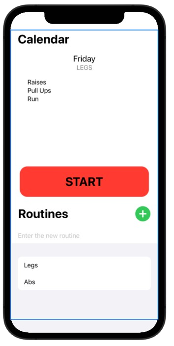
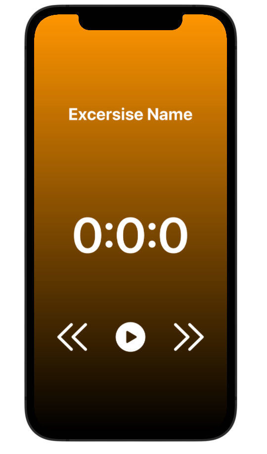
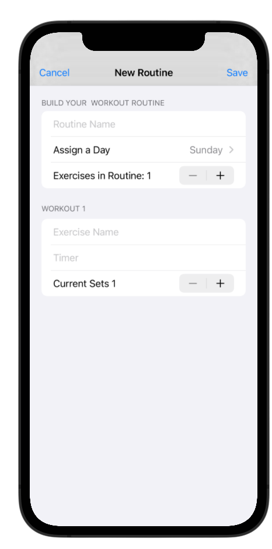

# Excerise App

The following application runs on SwiftUI and it is a personal project on the works. It was born out of curiosity about creating an application and personal necessities.  

This application contains:  
* **Main Screen**  
  
* **Timer**  
  
* **Add Routine**  
  
* **Detail Infomration from Routine Created**  
